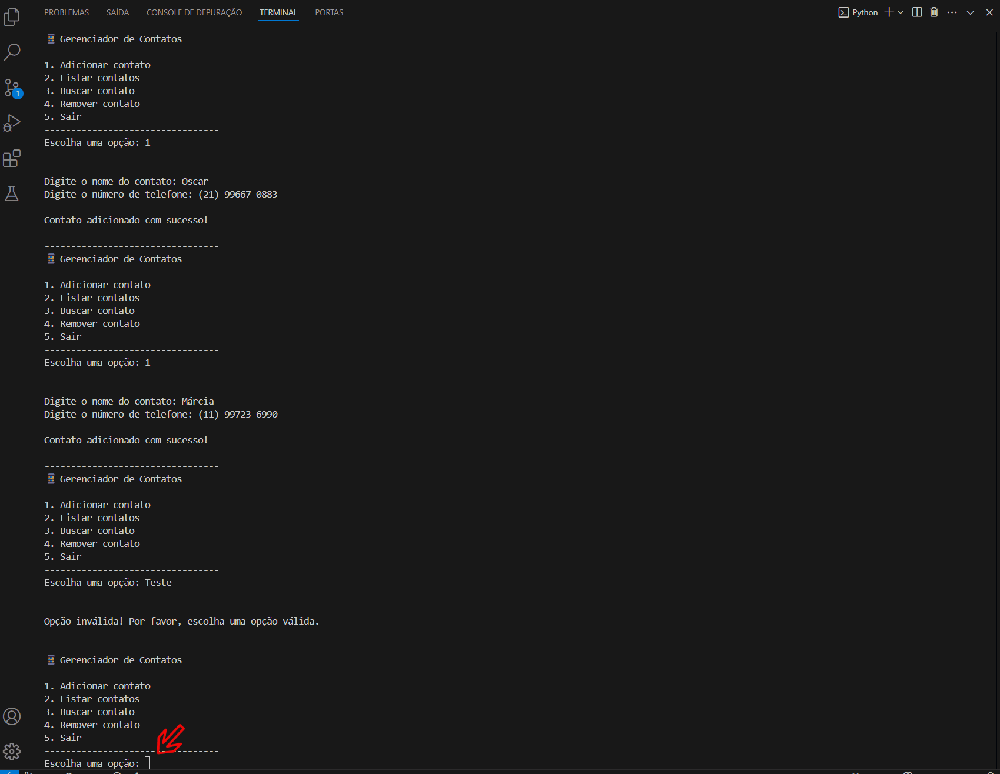

# Sistema de Gerenciamento de Contatos (Modo CLI)

Este projeto simula um sistema simples de gerenciamento de contatos em Python, com funcionalidades básicas de cadastro, listagem, busca e remoção de dados via terminal.  
Ideal para praticar lógica de programação, estruturação com listas de dicionários e controle de fluxo interativo.

## Problema que resolve
Armazenar e gerenciar contatos de forma simples, sem depender de planilhas ou softwares externos.  
Também pode ser usado como base para estudantes e desenvolvedores em início de carreira praticarem os fundamentos de CRUD.

## Solução implementada
- Menu interativo com opções de adicionar, listar, buscar e remover contatos
- Armazenamento em lista de dicionários
- Laço de repetição com controle de execução até o usuário sair
- Validação de dados simples e mensagens de retorno ao usuário

## Tecnologias
- Python 3.11
- Estruturas de dados: listas e dicionários
- Entrada de dados via terminal

## Resultados
- Projeto ideal como exercício de lógica, introdução ao CRUD e prática de controle de fluxo
- Fácil adaptação para interfaces gráficas ou integração com arquivos/bancos de dados

## Demonstração


## Como executar

```bash
python contatos.py
